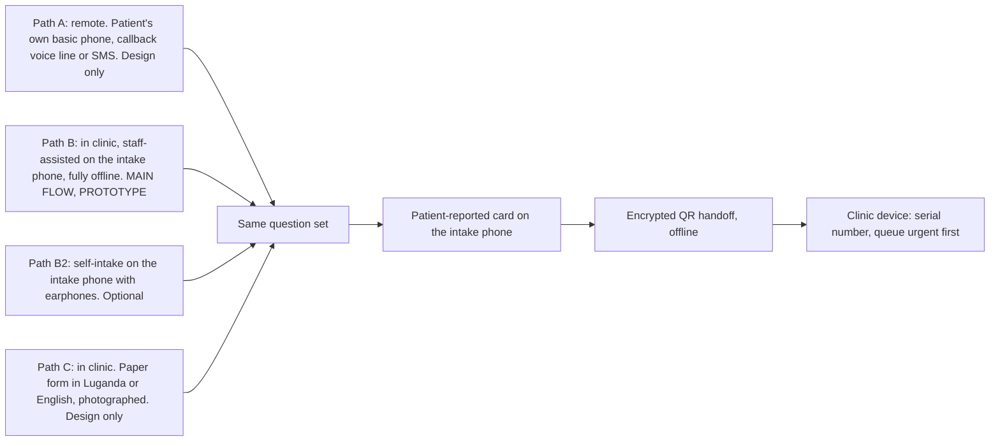
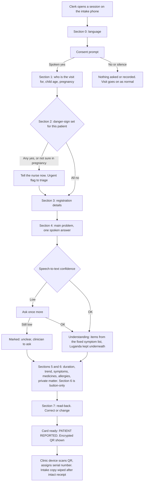
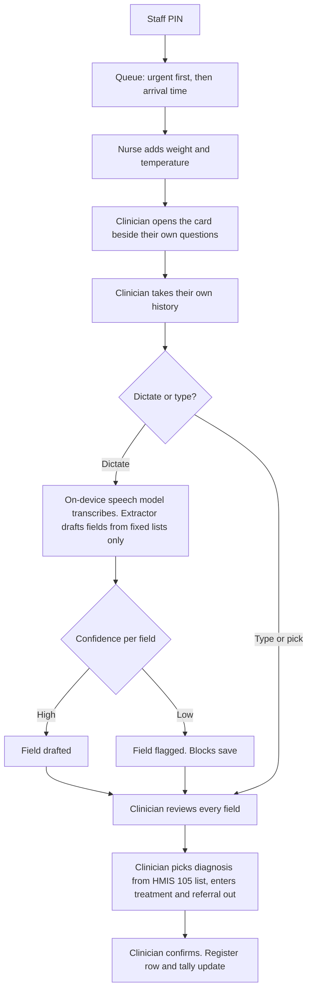
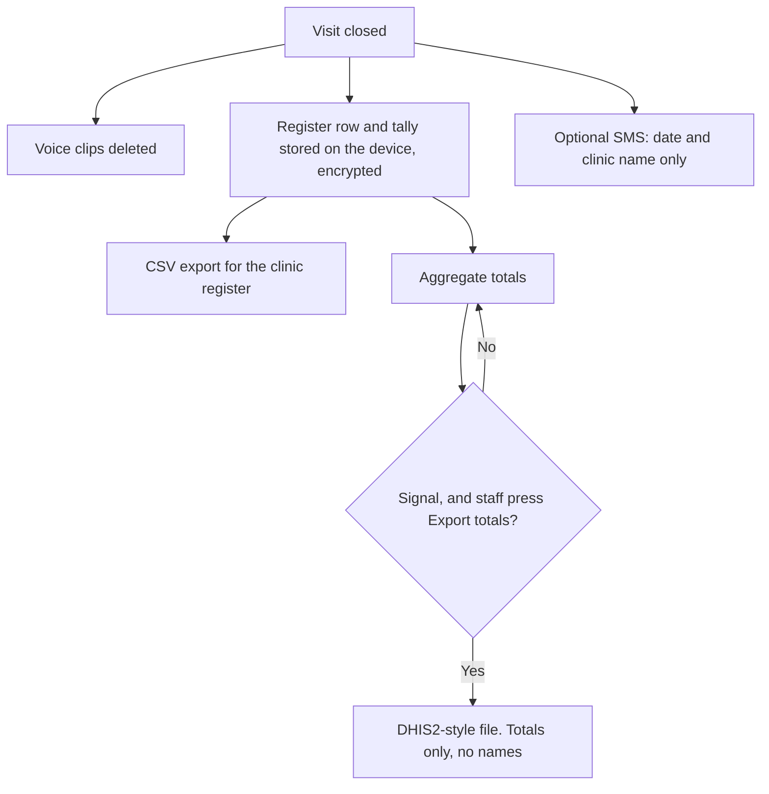
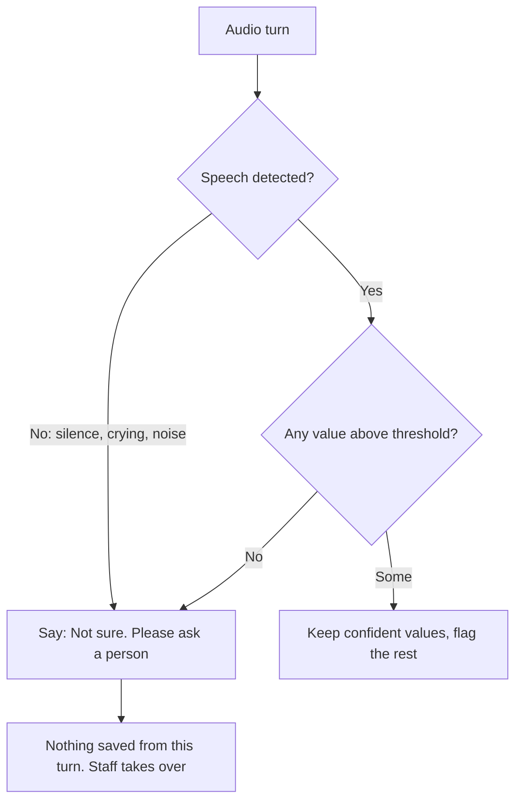
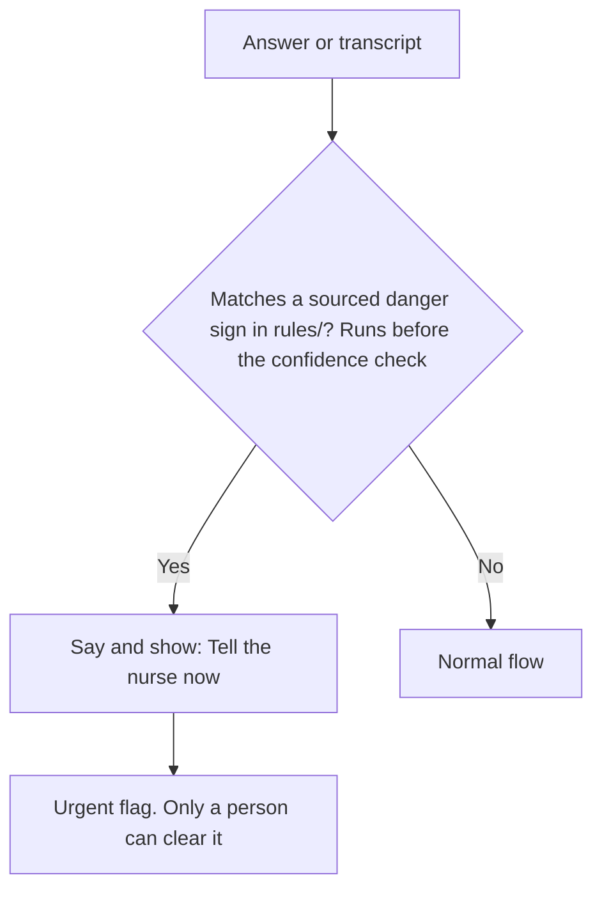
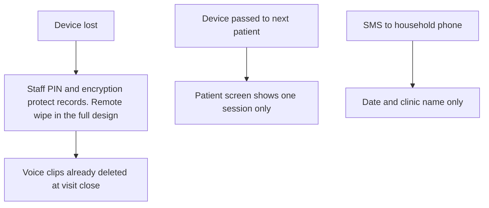

# User flows

Each flow maps to features and components in [prd.md](prd.md). Wording on screen follows [design-system.md](../design/design-system.md). The source of truth for flows is the Figma [TuWulira Project hub](https://www.figma.com/design/46MiynCpDjTcAiYoqmiaEr/TuWulira---Project-hub?node-id=0-1), *System Diagram* page, *Final system diagram*.

## 1. Three paths, one card

One question set, several ways in. Every path produces the same patient-reported card. Devices and data: [data-architecture.md](data-architecture.md).



## 2. Patient journey (Path B, staff-assisted, main flow)

1. Patient arrives; clerk opens a session on the intake phone and records consent (spoken yes or button).
2. Question order: consent → danger signs → main problem (spoken, Luganda) → registration → follow-ups → medicines → read-back (on screen or earphones only).
3. Any danger YES → urgent alert on the intake phone immediately.
4. Intake phone shows an encrypted QR; clinic device scans it, assigns the register serial number, and adds the patient to the queue (urgent first).
5. Intake copy is wiped after an intact receipt; unscanned sessions are wiped at the end of the day.
6. Nurse adds weight + temperature; clinician verifies each card item, takes own history, records diagnosis (HMIS 105, multiple allowed), treatment, referral out.
7. Register row and tallies update on the clinic device; totals export to DHIS2 when there is signal.

## 3. Intake (before the visit, F1, components 1 to 6)



Every question also accepts **Not sure** and **Ask clinician**.

## 4. Consultation (during the visit, F2 and F6, components 7 and 11)



## 5. Records and sync (after the visit, F4, F5, components 8 to 10)



## 6. Remote danger sign (Path A, design only, decision D4)

```mermaid
flowchart TD
  A[Patient answers on own phone] --> B{Danger-sign yes?}
  B -->|No| C[Card waits for the clinic visit]
  B -->|Yes| S[SMS: [Clinic name]: please come in today. Date and clinic name only]
  S --> P{May we tell the clinic and share your answers?}
  P -->|Yes| Y[Alert and card sent to the clinic Android at the triage desk]
  P -->|No| N[Nothing shared]
```

The SMS keeps to the "date and clinic name only" rule (PR12), because household phones are shared.

## 7. "Not sure, ask a person"



## 8. Danger sign (in clinic)



## 9. Lost or shared phone


