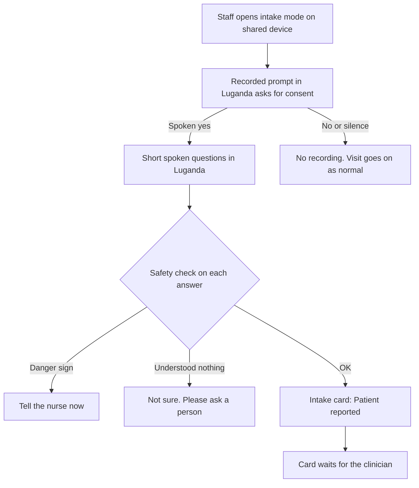
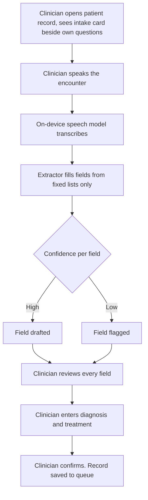
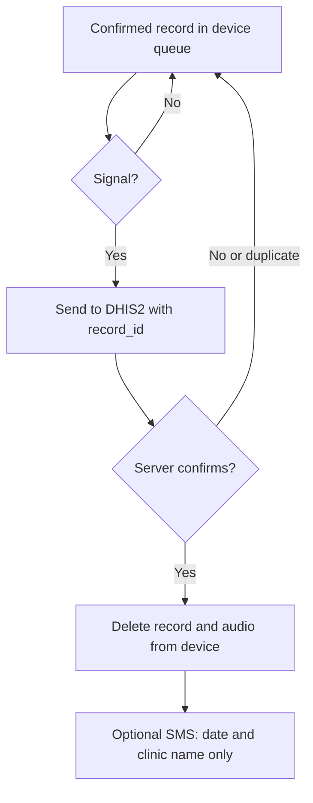
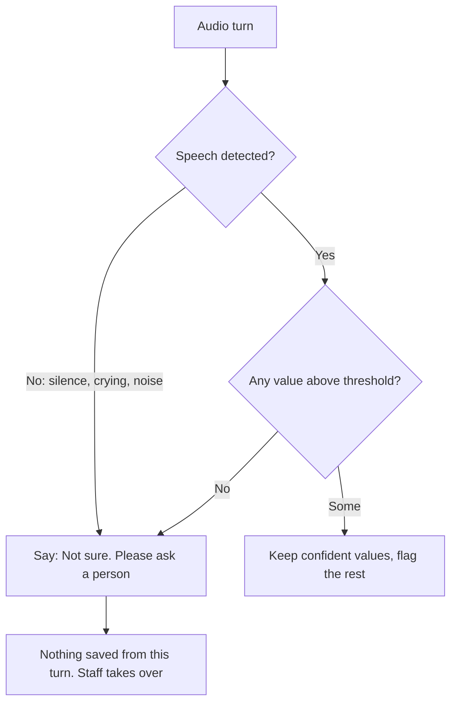
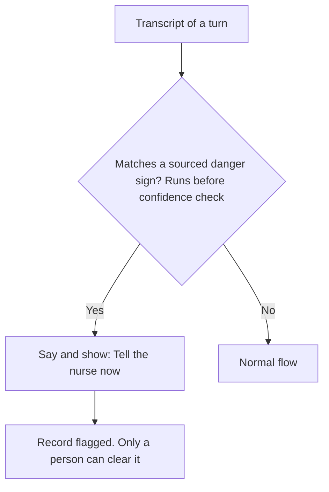
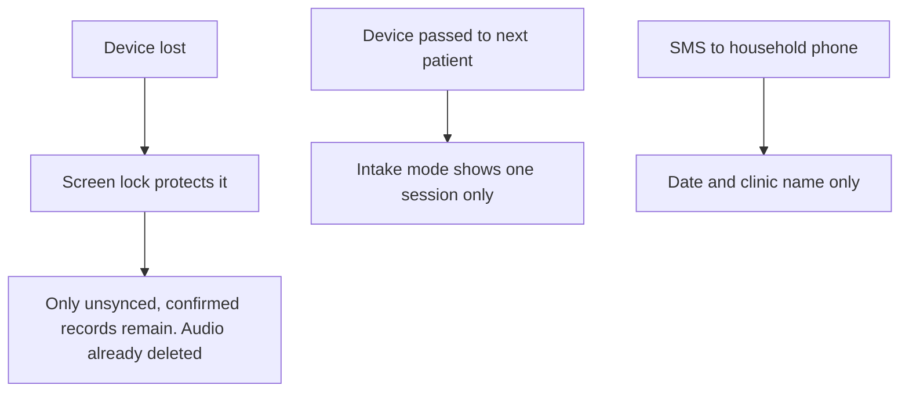

# User flows

Each flow maps to features in [prd.md](prd.md). Wording on screen follows [design-system.md](../design/design-system.md).

## 1. Intake (before the visit, F1)

Voice callback path for a basic phone: the clinic device calls the patient, plays the same prompts, and builds the same card. TODO: decide whether the demo shows this (it needs a SIM and signal).

## 2. Scribe (during the visit, F2)

## 3. Sync (after the visit, F4, F5)

## 4. "Not sure, ask a person"

## 5. Danger sign

## 6. Lost or shared phone

