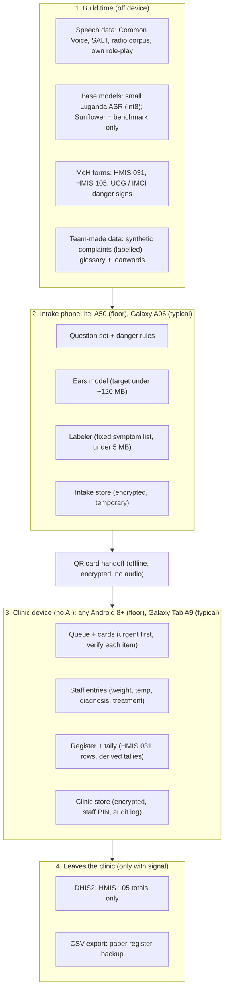
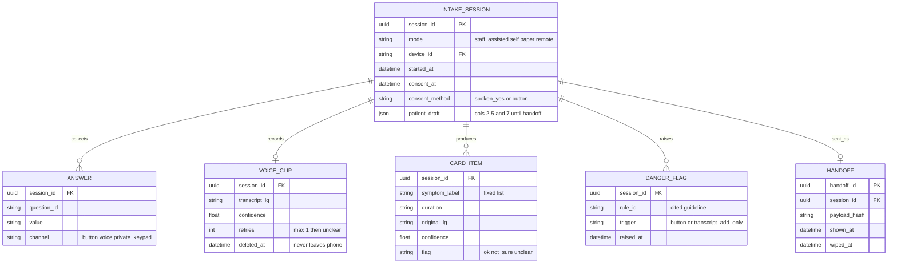
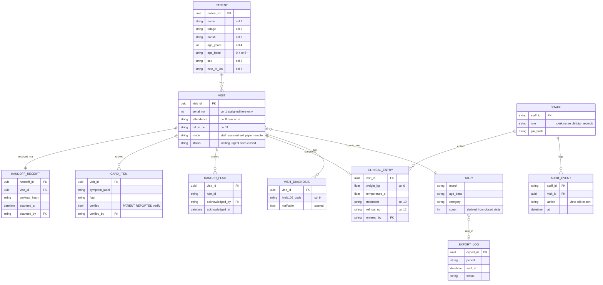

# TuWulira — Data architecture (two-device, v2)

**Status:** Agreed 4 Oct 2026
**Figma:** [TuWulira — Project hub → System Diagram → *Data architecture — two-device (v2)*](https://www.figma.com/design/46MiynCpDjTcAiYoqmiaEr/TuWulira---Project-hub?node-id=99-2)

All AI runs on the **intake phone**. The **clinic device** runs no AI. The patient card moves between them by **QR code**, fully offline. Only aggregate totals leave the clinic.

Sizes below are **targets**. They must be measured on a real low-end phone before they are quoted in the video.

---

## 1. Layers

## 2. Reference devices

| Role | Floor | Typical |
|---|---|---|
| Intake phone (AI runs here) | itel A50, 2 GB RAM, Android 14 Go, Unisoc T603, 5000 mAh, earphones in box. From ~UGX 275,000 | Samsung Galaxy A06, 4 GB RAM, Android 14, Helio G85, 5000 mAh. ~UGX 400,000–450,000 |
| Clinic device (no AI) | Any Android 8+ phone already at the facility (second itel, VHT eCHIS phone) | Samsung Galaxy Tab A9 8.7", 4 GB RAM, Helio G99, 5100 mAh. ~UGX 520,000–820,000 |
| One-device mode | Intake phone holds both roles; staff screens behind a PIN | — |

**Assumption to state in the submission:** no source confirms a shared device pool inside HC II/III facilities. eCHIS Android phones exist at VHT level. We target the same entry-level, offline-first Android profile.

**Why these devices:** Samsung leads usage share in Uganda; Transsion brands (Tecno, Infinix, itel) lead shipments across Africa. One Transsion floor phone plus one Samsung covers both.

## 3. Intake phone size budget (targets)

| Item | Target |
|---|---|
| Ears model (int8) | Under ~120 MB |
| Labeler + glossary | Under 5 MB |
| Recorded prompts | ~5 MB |
| App + database | ~30 MB |
| **Total bundle** | **Under ~160 MB** |
| Peak memory while transcribing | Under ~300 MB |
| If it does not fit on 2 GB | State the floor as itel A50 3 GB |

Build settings: minSdk 26 (Android 8), ship `arm64-v8a` and `armeabi-v7a`, no GPU dependence.

## 4. What lives where

| Data | Intake phone | Clinic device |
|---|---|---|
| Answers, danger flags, card items | Until handoff | After scan |
| Voice clips | Deleted at visit close | Never |
| Patient details (cols 2–5, 7) | Draft until handoff | Yes |
| Staff entries (cols 6, 9, 10, 12) | Never | Yes |
| Register rows, tally, export log | Never | Yes |
| Unscanned sessions | Wiped at end of clinic day | — |

**QR payload:** card items, danger flags, answers, patient draft. No audio, no confidence scores. Encrypted with a key set when the two devices are paired at the clinic. Shown on screen only, never printed.

**Danger flags:** in staff-assisted mode the clerk sees the alert on the intake phone immediately. In self-intake mode, any danger YES shows a full-screen "go to the nurse now".

## 5. Intake phone database (temporary)

## 6. Clinic device database (permanent)

## 7. Changes from v1

| # | Change | Why |
|---|---|---|
| 1 | Split into intake (temporary) and clinic (permanent) databases | Two-device setup; intake phone keeps nothing long term |
| 2 | `VISIT` on the intake phone became `INTAKE_SESSION` with `patient_draft` | No permanent patient record on a shared or lost phone |
| 3 | New `HANDOFF` / `HANDOFF_RECEIPT` linked by `payload_hash` | Records the QR transfer; intake copy wiped only after an intact receipt |
| 4 | `serial_no` assigned on the clinic device only | Avoids duplicate register serials across intake phones |
| 5 | Added `mode` | Staff-assisted is the main flow; all paths share tables |
| 6 | Added `consent_at`, `consent_method` | Data Protection and Privacy Act (2019), research question 5.1 |
| 7 | `ANSWER.channel` with `private_keypad` | Sensitive items use keypad + earphones (Q2.1) |
| 8 | `VOICE_CLIP` intake-only, with `retries` | Audio never leaves the phone; ask once more, then unclear |
| 9 | `CARD_ITEM.confidence`; `verified`, `verified_by` on clinic | "PATIENT REPORTED — verify" per item (Q2.4) |
| 10 | `DANGER_FLAG.trigger`, `acknowledged_by` | Transcript can only add a flag (4.2); shows a nurse responded |
| 11 | `CLINICAL_ENTRY.temperature_c`, `entered_by` | Temperature was in the PRD but missing from the diagram |
| 12 | New `VISIT_DIAGNOSIS` with `notifiable` | HMIS 105: multiple diagnoses, starred notifiable cases |
| 13 | `PATIENT.age_band` | Tally needs 0–4 / 5+ directly |
| 14 | New `STAFF`, `AUDIT_EVENT` | Answers "who can read it"; role-based access |
| 15 | New `EXPORT_LOG`; `TALLY` marked derived | What went to DHIS2 and when; tallies are never typed |

**Decided:** re-attendance is matched on the clinic device after scanning; unscanned sessions are wiped at the end of the clinic day; the QR carries card items, flags, answers and the patient draft, with no audio and no confidence scores.

## 8. Privacy answers the brief asks for

| Question | Answer |
|---|---|
| Where does the data sit? | Intake phone: encrypted, temporary, wiped after handoff or at day end. Clinic device: encrypted SQLite (SQLCipher) behind a staff PIN. |
| Who can read it? | Staff by role (clerk, nurse, clinician, records). Every view, edit and export is written to `AUDIT_EVENT`. |
| What if the phone is lost or shared? | Intake phone exposes at most the current day's waiting patients, encrypted. Clinic device is PIN-protected and encrypted; remote wipe in the full design. |
| What leaves the clinic? | Aggregate HMIS 105 totals only. No names, no patient-level data, no audio. |
